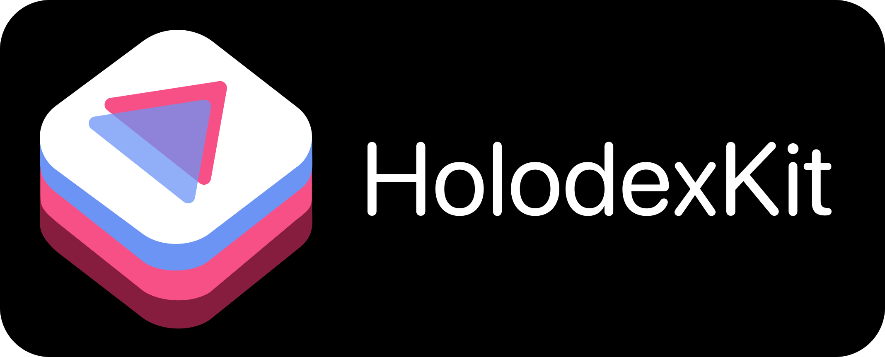

[](https://img.shields.io/badge/Swift-5.5_5.6_5.7-Orange?style=flat-square)
[](https://img.shields.io/badge/Platforms-macOS_iOS_tvOS_watchOS-green?style=flat-square)
[](https://img.shields.io/badge/Swift_Package_Manager-compatible-orange?style=flat-square)

HolodexKit is an API for the Holodex REST endpoint.

- [Features](#features)
- [ToDo](#todo)
- [Requirements](#requirements)
- [Installation](#installation)
  - [Swift Package Manager](#swift-package-manager)
    - [SPM Through Xcode Project](#spm-through-xcode-project)
    - [SPM Through Xcode Package](#spm-through-xcode-package)
- [Using HolodexKit](#using-holodexkit)
- [Development and Testing](#development-and-testing)
- [Next Steps](#next-steps)
- [Credits](#credits)
- [License](#license)

## Features

- [x] Query Live and Upcoming Videos of VTubers and subbers.
- [x] Query Videos of VTubers and subbers.
- [x] Get Channel Information of VTubers and subbers.
- [x] Query Videos Related to the Channel of a VTuber or subber.
- [x] Quickly Access Live / Upcoming Videos for a set of Channels of VTubers and subbers.
- [x] Get a single Video's metadata from a VTuber or subber.
- [x] List Channels of VTubers and subbers.
- [x] Comprehensive Unit and Integration Test coverage.
- [x] Swift Concurrency Support back to iOS 13, macOS 10.15, tvOS 13, and watchOS 6.

## ToDo

- [ ] Endpoint search for Videos of VTubers and subbers.
- [ ] Endpoint search for Comments from Videos of VTubers and subbers.
- [ ] Complete documentation of HolodexKit.

## Requirements

| Platform | Minimum Swift Version | Installation | Status |
| --- | --- | --- | --- |
| iOS 13.0+ / macOS 10.15+ / tvOS 13.0+ / watchOS 6.0+ | 5.5 | [Swift Package Manager](#swift-package-manager) | Fully Tested |

## Installation

### Swift Package Manager

The [Swift Package Manager](https://swift.org/package-manager/) allows for developers to easily integrate packages into their Xcode projects and packages; and is also fully integrated into the `swift` compiler.

#### SPM Through XCode Project

* File > Swift Packages > Add Package Dependency
* Add `https://github.com/marcodotio/HolodexKit.git`
* Select "Up to next Major" with "1.0.0"

### SPM Through Xcode Package

Once you have your Swift package set up, add the Git link within the `dependencies` value of your `Package.swift` file.

```swift
dependencies: [
	.package(url: "https://github.com/marcodotio/HolodexKit.git", .upToNextMajor(from: "1.0.0"))
]
```

## Using HolodexKit

HolodexKit is designed to be very easy to integrate into your own projects. The main method of utilizing HolodexKit is to set a `Holodex` class object:

```swift
import HolodexKit

// Using the Holodex dummy server as provided in the endpoint
// documentation.
let holodexDummy = Holodex()

// Using the Holodex production server.
let holodexProduction = Holodex(withApiKey: "INSERT-YOUR-API-KEY-HERE")
```

From there, it's as easy as calling one of the provided function members. The code below demonstrates how you can retrieve the current live videos:

```swift
do {
	guard let videos = holodexProduction.getLiveVideos() else { return }
} catch {
	// Insert your own error handling method here.
}
```

As well, you are able to make fine tune adjustments to the query using the `VideoParameter` struct:

```swift
do {
	let videoParam = VideoParameter(limit: 10, org: .hololive)
	guard let videos = holodexProduction.getLiveVideos(
		withParameters: videoParam
	) else { return }
} catch {
	// Insert your own error handling method here.
}
```

## Development And Testing

I welcome anyone to contribute to the project through posting issues, if they encounter any bugs / glitches while using HolodexKit; as well with creating pull issues that add any additional features to HolodexKit.

## Next Steps

* In the near future, there will be full documentation outlining how a user can fully utilize HolodexKit.
* As well, more features listed in [ToDo](#todo) will be fully implemented.
* More examples, from other platforms, will be uploaded for developers to be able to focus more on implementing the end user experience, and less time figuring out their project's architecture.

## Credits

I would like to personally thank the [Holodex Team](https://twitter.com/holodex) for implementing the REST endpoint, as without them, this project wouldn't have been possible.

## License

HolodexKit is released under the MIT license, and any use of the production server will be under the [License](https://holodex.stoplight.io/docs/holodex/8166fcec5dbe2-license) set by the Holodex Team. [See LICENSE](https://github.com/marcodotio/HolodexKit/blob/master/LICENSE) for details.